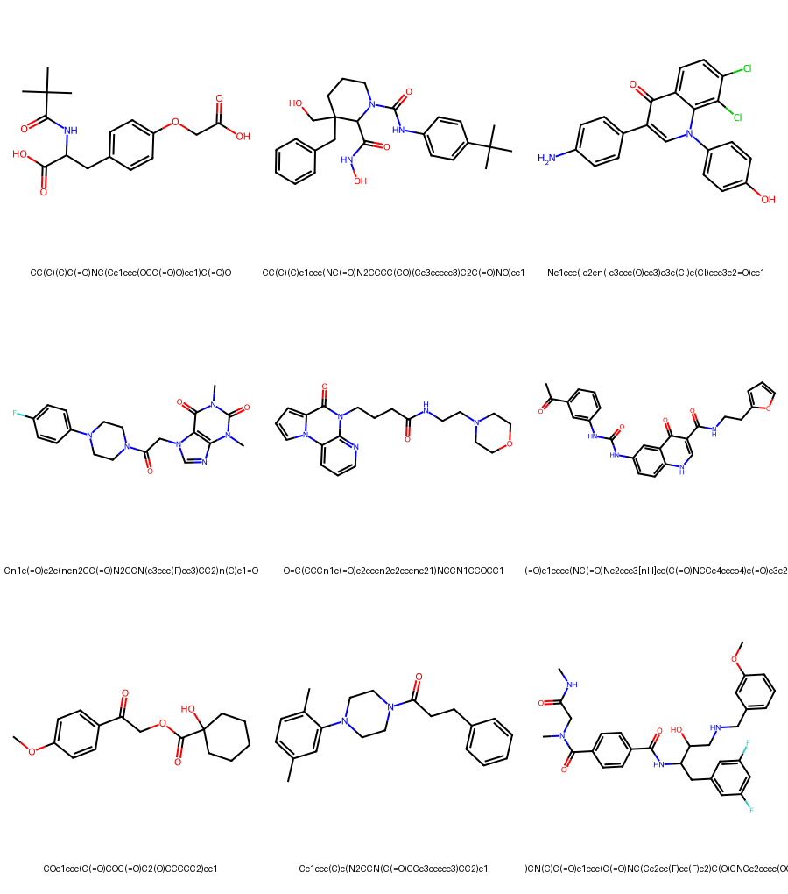

# SMILES Molecular Generator

A PyTorch-based implementation for **de novo molecular generation** using **SMILES strings**. The model learns chemical patterns from datasets (e.g., ChEMBL) and generates novel molecules with potential applications in **drug discovery** and **computational chemistry**.

---

## Project Structure

```
SMILES_Gen.ipynb   # Main Jupyter Notebook for training & generation
/datasets/
    ChEMBL.txt     # Dataset containing SMILES strings
    atom_types.txt # List of atom types used in molecule construction
```

---

## Features

* Uses **PyTorch** for deep learning.
* Character-level **SMILES tokenizer** with special tokens (`<PAD>`, `<SOS>`, `<EOS>`, `<UNK>`).
* **LSTM language model** for molecule generation.
* Custom training loop with early stopping & checkpointing.
* Generation of **novel chemical structures** in valid SMILES format.

---

## Model Architecture

The molecular generator is based on a **character-level sequence model**:

* **Embedding Layer**: Learns dense representations of SMILES tokens.
* **LSTM (2 layers)**: Captures sequential chemical dependencies.

  * Hidden size: 512
  * Dropout: 0.2
* **Fully Connected Layer**: Maps LSTM outputs to vocabulary space.
* **Loss Function**: Cross-Entropy (ignores `<PAD>` tokens).
* **Optimizer**: AdamW with learning rate scheduling.
* **Training Strategy**:

  * Early stopping on validation loss.
  * Gradient clipping for stability.
  * Model checkpoints saved periodically.

This is essentially a **language model for chemistry**, similar to text generation but applied to SMILES.

---

### Requirements

* Python 3.8+
* PyTorch
* RDKit
* pandas, numpy, tqdm

If RDKit is not available via pip, install via:

```bash
conda install -c conda-forge rdkit
```

---

## Usage

1. Prepare dataset:

   * Place `ChEMBL.txt` (SMILES dataset) and `atom_types.txt` inside `/datasets/`.
2. Open the notebook:

   ```bash
   jupyter notebook SMILES_Gen.ipynb
   ```
3. Run all cells to:

   * Preprocess SMILES
   * Train the model
   * Generate new molecules

---

## Example Output

* Trained model generates SMILES like:

  ```
  C1=CC=CC=C1
  CCN(CC)CCO
  O=C(O)C1=CC=CC=C1
  ```
* Molecules can be visualized using RDKit.


---
